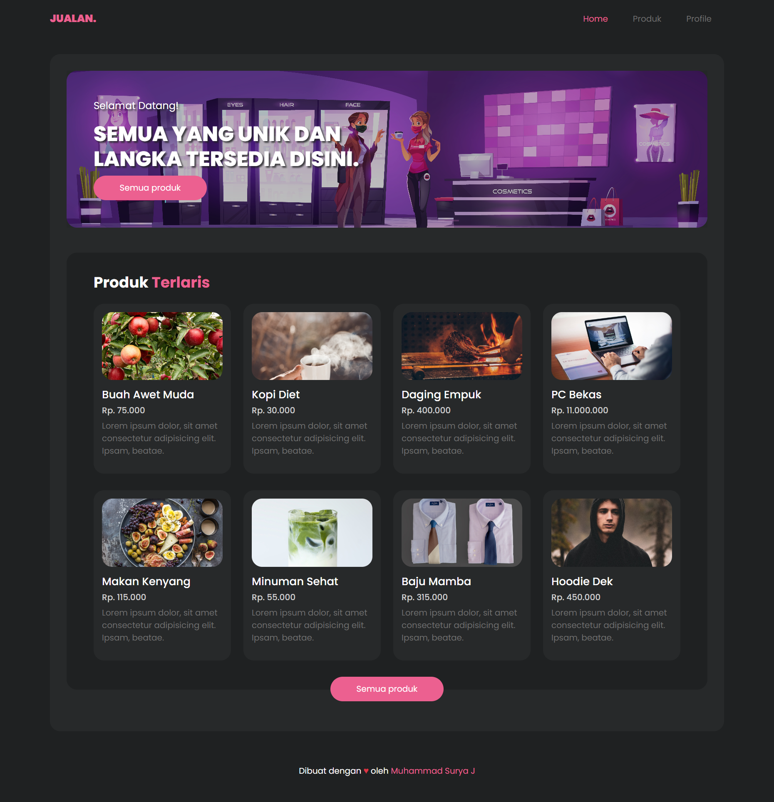

 
  

  &#xa0;

  <!-- <a href="https://jualantemplate.netlify.app">Demo</a> -->

<h1 align="center">Jualan Template</h1>

  

  

  

  

  <!--  -->

  <!--  -->

  

<!-- Status -->

<!-- <h4 align="center"> 
	🚧  Jualan Template 🚀 Under construction...  🚧
</h4> 

 -->

  <a href="#dart-about">About</a> &#xa0; | &#xa0; 
  <a href="#rocket-technologies">Technologies</a> &#xa0; | &#xa0;
  <a href="#memo-license">License</a> &#xa0; | &#xa0;
  <a href="https://github.com/suryamsj" target="_blank">Author</a>

 

## :dart: About ##

Template jualan adalah sebuah project yang ingin saya kembangkan menggunakan Svelte. Namun, ini hanya template nya saja.

## :rocket: Technologies ##

The following tools were used in this project:

- [Bootstrap](https://getbootstrap.com/)
- [SCSS](https://sass-lang.com/)
- [Unsplash API](https://awik.io/generate-random-images-unsplash-without-using-api/)

## :memo: License ##

Project ini berlisensi MIT. Untuk lebih detail, lihat file [LICENSE](LICENSE).

Dibuat dengan :heart: oleh <a href="https://github.com/suryamsj" target="_blank">Muhammad Surya Jayadiprana</a>

&#xa0;

<a href="#top">Back to top</a>
